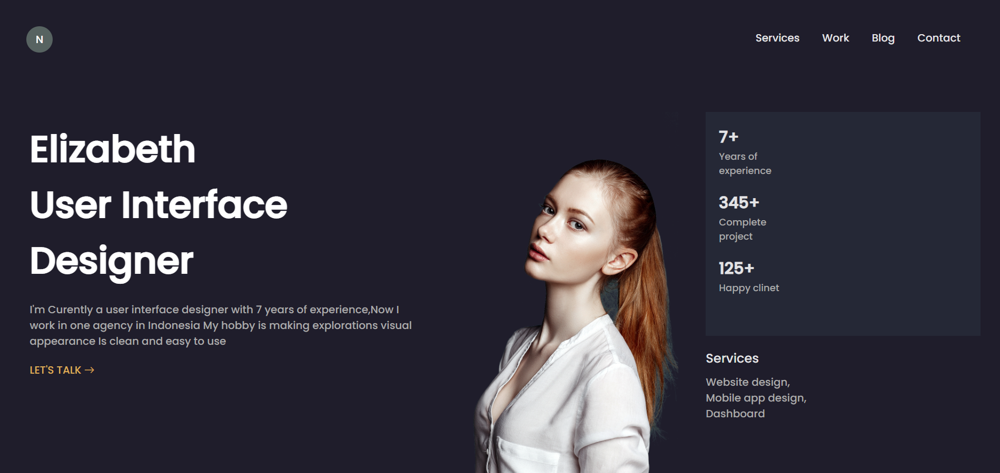
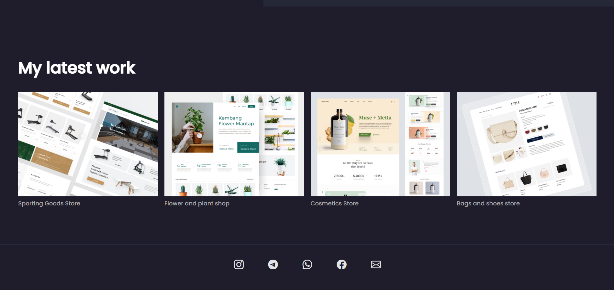

<h1 align="center">Personal Website Design</h1>

</img> 
</img>
</img> 

 

<h1>Introducing different sections of the website :</h1>
:woman_student: About me section
  
:cityscape: Company section
  
:man_technologist: Services section
  
:books: Latest work section
  
:speech_balloon: Social Medias section

<h1> Features : </h1>
:art: Change the color theme of the website 
  
:camera: Add your pesonal image in About me section
  
:information_desk_person: Publish Brief biography and The services you provide in About me section
  
:office: Add Companies you have worked with in Company section
  
:nerd_face: Add your services with the image in Services section
  
:clock1030: Add your Latest works with th image in Latest works section
  
:calling: Publish a way to communicate with yourself in Social Medias section
