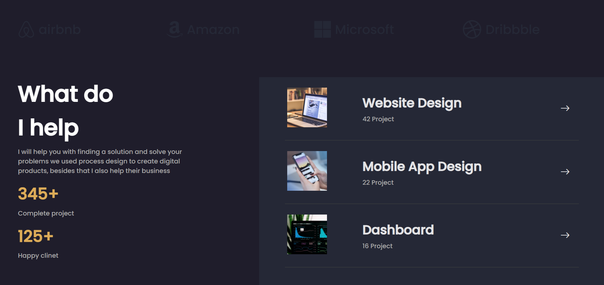

<h1 align="center">Personal Website Design</h1>

</img> 
</img>
</img> 

 

<h3>Introducing different sections of the website :</h3>
<h4>:woman_student: About me section</h4>
<h4>:cityscape: Company section</h4>
<h4>:man_technologist: Services section</h4>
<h4>:books: Latest work section</h4>
<h4>:speech_balloon: Social Medias section</h4>

<h3> Features : <h3/>
<h4>:art: Change the color theme of the website </h4>
<h4>:frowning_woman: Add your pesonal image in About me section</h4>
<h4>:information_desk_person: Publish Brief biography and The services you provide in About me section</h4>
<h4>:office: Add Companies you have worked with in Company section</h4>
<h4>:nerd_face: Add your services with the image in Services section</h4>
<h4>:clock1030: Add your Latest works with th image in Latest works section</h4>
<h4>:calling: Publish a way to communicate with yourself in Social Medias section</h4>
